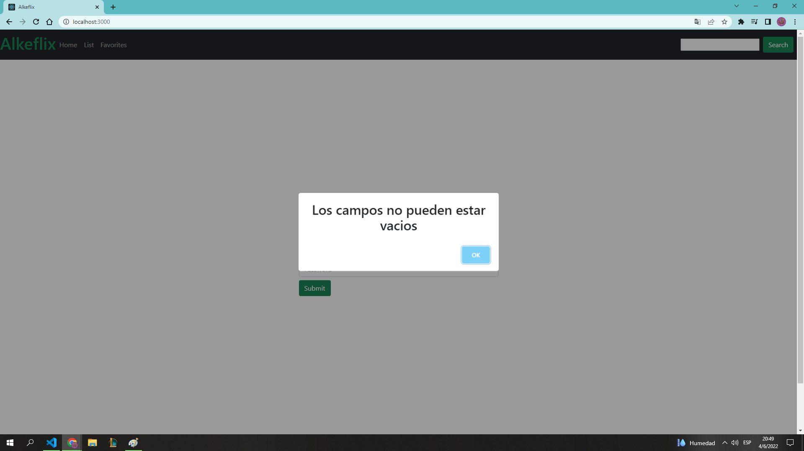
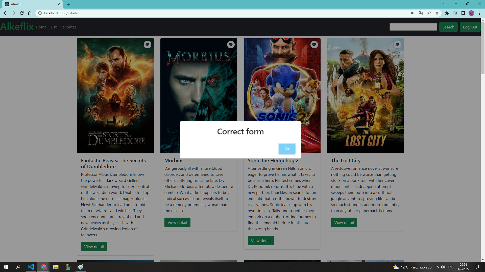
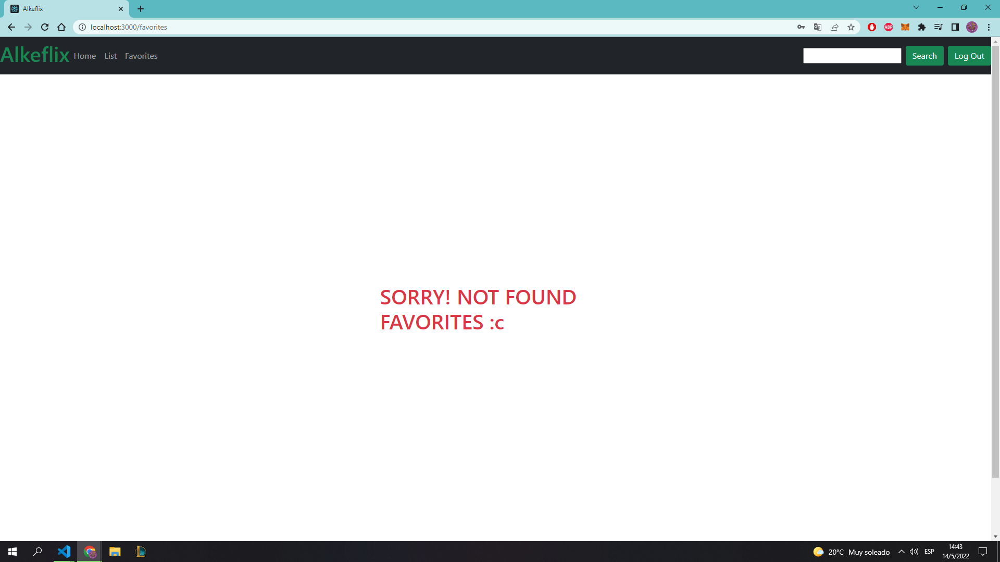
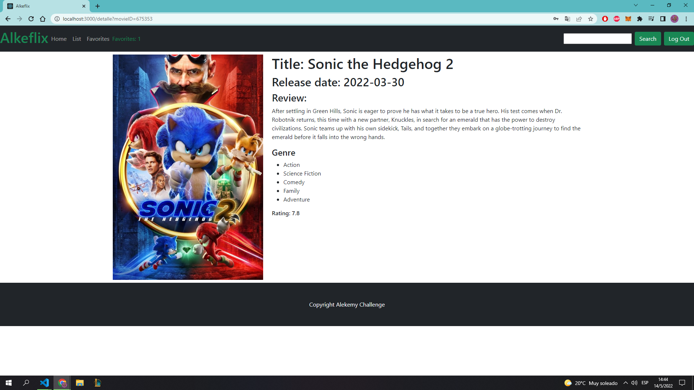
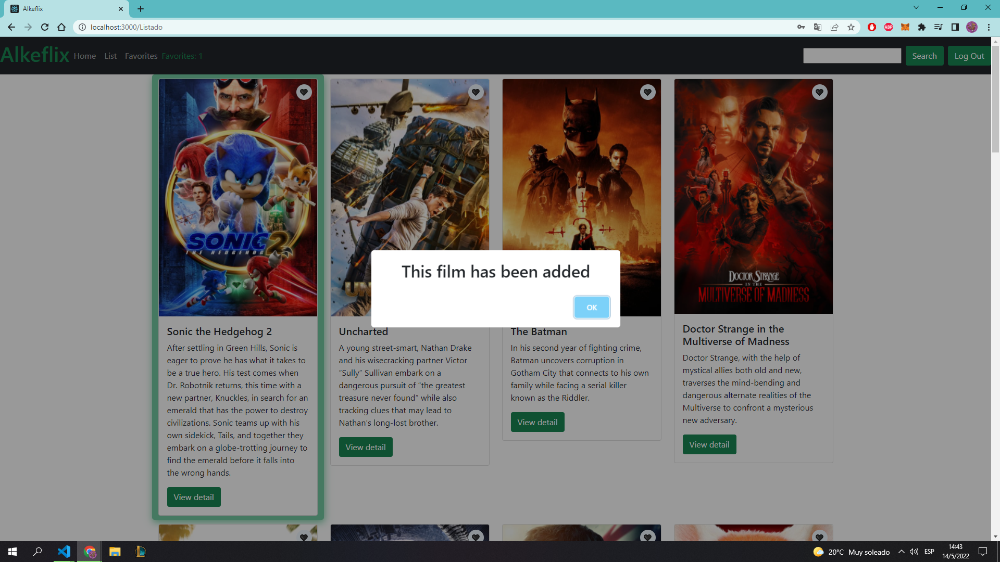
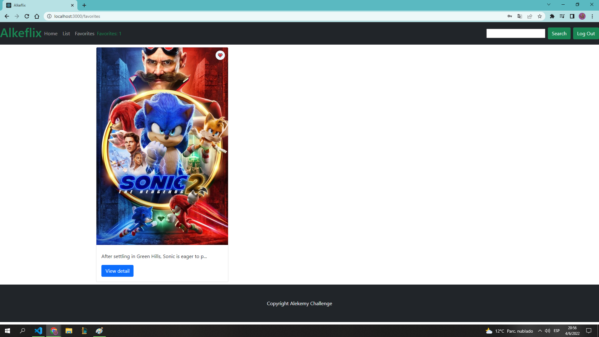

# Getting Started with Create React App

This project was bootstrapped with [Create React App](https://github.com/facebook/create-react-app).

## Available Scripts

In the project directory, you can run:

### `npm start`

Runs the app in the development mode.\
Open [http://localhost:3000](http://localhost:3000) to view it in your browser.

### `Alkeflix`

### `Login:`
Tenemos una validacion para loguearnos, con los siguientes datos..
User: challenge@alkemy.org
pass: react

Si los datos no son correctos..

En cambio, si son correctos..

Si intentamos buscar peliculas sin loguearnos, no podremos..

### `Add to Favorites:`
Podemos añadir a favoritos

La Lista:

Si no hay ninguna..

### `More Info`
Podemos indagar por más informacion en cada una de las peliculas..

