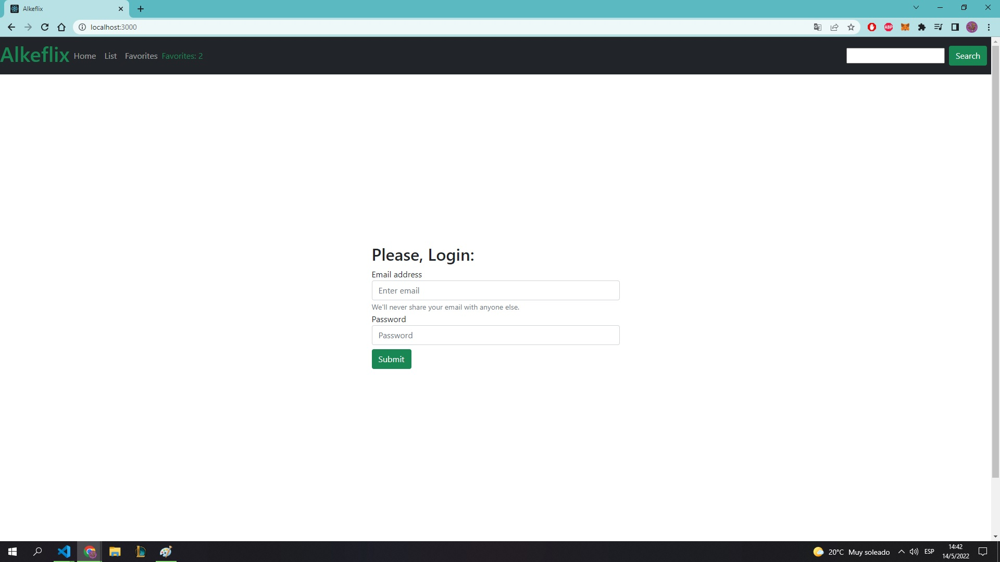

# Getting Started with Create React App

This project was bootstrapped with [Create React App](https://github.com/facebook/create-react-app).

## Available Scripts

In the project directory, you can run:

### `npm start`

Runs the app in the development mode.\
Open [http://localhost:3000](http://localhost:3000) to view it in your browser.

### `Alkeflix`
### `Login:`
User: challenge@alkemy.org
pass: react

### `Add to Favorites`

### `Error!`

### `More Info`

